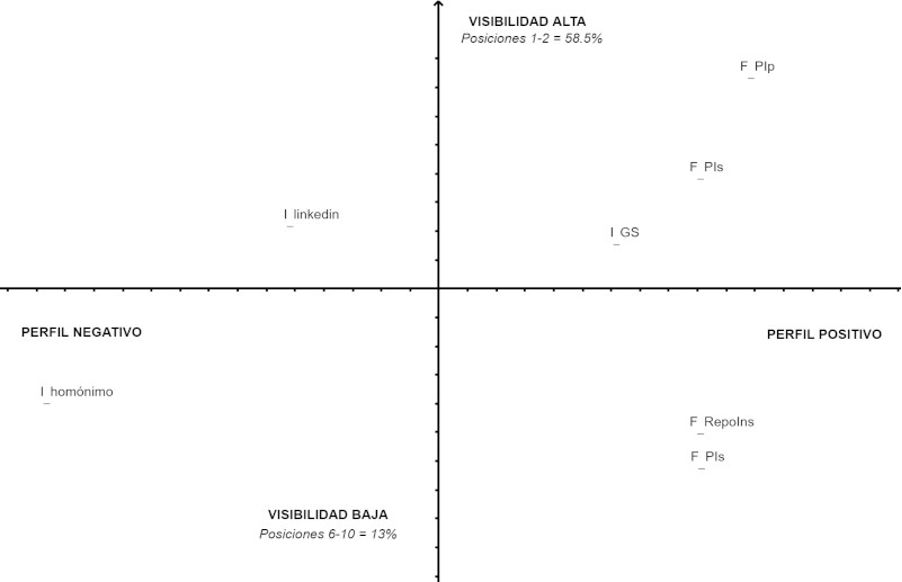

---
# Metadatos ESENCIALES del capítulo (no repetitivos)
pdf-engine: xelatex
title: "Hegemonía algorítmica y visibilidad académica. Una propuesta metodológica"
subtitle: ""

author:
  - name: "Fernando Christian Hernández Pérez"
    affiliation: "Universidad Autónoma Metropolitana, Unidad Azcapotzalco."
    orcid: ""  # Si el autor lo proporciona
    email: "yadgana@gmail.com"  # Si el autor lo proporciona
    correspondence: true

# Metadatos ESPECÍFICOS del capítulo (no centralizables)
chapter-number: "2"
page-range: ""  # Ajustar según paginación final
doi: ""  # DOI del capítulo (cuando se asigne)

# Contenido del capítulo
resumen: |
  Este artículo expone una propuesta metodológica que permite conocer la influencia que tiene el algoritmo de búsqueda de Google en la visibilidad de los perfiles académicos en internet. A partir de la información que arroja la búsqueda en Google del nombre propio de una muestra de académicos (n=81) adscritos al Sistema Nacional de Investigadores en México, esta propuesta construye un indicador de visibilidad al operacionalizar el tipo de información y el grado de exposición o notoriedad que dichos resultados de búsqueda asignan a los perfiles académicos. De manera general, esta propuesta busca contribuir al análisis de los algoritmos digitales en el contexto de los estudios sociales y culturales.

keywords:
  - "Comunicación académica"
  - "Algoritmos"
  - "Visibilidad"

# Tipo de documento
type: chapter

# Personalización específica (opcional, solo si varía por capítulo)
footer-note: |
  \newcommand{\articuloTitulo}{Hegemonía Algorítmica y Visibilidad Académica}

# Campos OPCIONALES (dejar en blanco o eliminar si no aplican)
acknowledgments: ""  # Agradecimientos específicos del capítulo
funding: ""  # Financiamiento específico
notes: ""  # Notas del autor
---

\addtocontents{toc}{\protect\hspace{1.5em}Fernando Christian Hernández Pérez\par}
\markboth{Hegemonía Algorítmica y Visibilidad Académica}{}

\begin{flushright}
\Large Christian Hernández Pérez\footnote{SEMBLANZA}
\end{flushright}

## Planteamiento {.unnumbered .unlisted}

A partir del uso masivo de internet, las plataformas de redes sociales y los motores de búsqueda se han consolidado como las principales herramientas digitales que las personas utilizan para interactuar entre familiares y amigos, mantenerse informados y consumir una extensa gama de contenido de entretenimiento[^c2_1]. La consolidación de la cultura digital, surgida del primer decenio del siglo XXI gracias al desarrollo de las tecnologías de banda ancha y móvil y la expansión del internet social [@Raine2012], ha permeado a la sociedad a tal grado que la interacción socio-digital entre las personas ha llegado a concebirse como una práctica cuasi natural.

[^c2_1]: En México, la Encuesta Nacional sobre Disponibilidad y Uso de Tecnologías de la Información en los Hogares (ENDUTIH) 2023 estima que entre las principales actividades que los internautas realizan en internet destacan la comunicación (93.3%); el acceso a las redes sociales (91.5%); y la búsqueda de información (87.7%). De igual manera, el estudio sobre los Hábitos de los usuarios de internet en México 2023 señala que el 84.8% de las personas utiliza internet para acceder a las redes sociales; el 76.3% para recibir/enviar correos electrónicos; el 69.5% lo emplea para enviar/recibir mensajes instantáneos.

Sin embargo, los intermediarios digitales con los que interactuamos día a día, minuto a minuto, exponen toda clase de contenido con base a un sesgo de origen, el cual determina en gran medida el tipo de recursos e información a los cuales las personas solo pueden acceder. Por ejemplo, desde hace un tiempo se sabe que los motores de búsqueda rastrean y almacenan las direcciones de internet; analizan los contenidos de los sitios web, los indexan y los jerarquizan según una serie de criterios que no son públicos y mucho menos imparciales [@Halavais2009: 15]. Estas máquinas de cálculo arrojan una serie de resultados "objetivos" que los usuarios supuestamente "eligen" para satisfacer sus necesidades de información.

El crecimiento acelerado y constante de contenidos en internet ha colocado a los motores de búsqueda como la principal herramienta que las personas utilizan para localizar cualquier tipo de información. El algoritmo de búsqueda es una suerte de aduana entre las personas y el cúmulo de información que potencialmente éstas pueden recibir[^c2_2]. E incluso más allá, el algoritmo de búsqueda se ha constituido como una máquina moral, un sistema de valores que recompensa con la notoriedad a quienes encajan con sus criterios matemáticos y supuestamente "meritocráticos" [@Cardon2013: 63].

[^c2_2]: Para formarse una idea más precisa de la influencia que tienen los motores de búsqueda en el acceso a la información, en mayo de 2014 la Unión Europea legisló una ley a favor del olvido digital. Esta disposición faculta a las personas a solicitar a los propietarios de los motores de búsqueda el retiro de información sensible y de datos personales que puedan aludirlas en los resultados de búsqueda. La legislación solo aplica al intermediario y no se hace extensiva hacia los propietarios de los sitios web que hayan creado y difundido los contenidos. ¿Quién puede encontrar algo en internet sino es mediante un buscador?

¿Quién no se ha detenido a googlear o buscar en redes sociales el nombre propio de una persona o el suyo mismo para conocer o recuperar algún tipo de información? En el caso del motor de búsqueda, los resultados que uno puede encontrar abarcan desde los aspectos generales de las personas (edad, profesión, experiencia laboral, lugar de residencia) hasta los detalles ínfimos de la vida privada (hábitos personales, estado civil, información bancaria, fotografías familiares, etcétera). La máquina algorítmica se atribuye la potestad de ocultar o mostrar determinada información según las características de navegación de las personas y el contenido digital que este vampiro de datos pueda extraer[^c2_3].

[^c2_3]: Esta propuesta no se detiene a buscar elementos para *descajanegrizar* la manera en la que operan los algoritmos de búsqueda. Solo está centrado en utilizarlos como una herramienta de recuperación de información y mostrar cómo este algoritmo puede influir significativamente en la percepción que las personas, ajenas al mundo académico, pueden llegar a formarse del trabajo de los investigadores.

El asunto puede cobrar mayor interés social cuando los resultados de búsqueda aluden a la información de personas que ocupan una posición pública, cuando los datos personales aluden a individuos cuyas actividades se encuentran en constante escrutinio.

Los académicos, sobre todo los investigadores dedicados a la producción de resultados de investigación, pertenecen a un grupo particular de actores públicos cuyo reconocimiento dentro de sus campos de estudio depende en gran medida del alcance que tenga la difusión de su trabajo. Aunque la reputación académica no se construye en el escenario del mundo digital, las disciplinas y las instituciones tienen sus propios métodos para reconocer el trabajo académico, la información disponible desde las plataformas digitales puede repercutir en la percepción que las personas, ajenas al mundo de las universidades y la vida académica, pueden formarse sobre el trabajo y la reputación de esta particular clase de expertos.

En la actualidad prolifera un amplio ecosistema de plataformas especializadas en ponderar la relevancia (formal e informal) que tienen los académicos dentro de sus respectivas disciplinas: por ejemplo, las tradicionales bases de datos para medir el impacto de las citaciones (Scopus y Web of Science) y las métricas y los scores alternativos al interior de ciertas redes sociales académicas (Academia.edu y Researchgate). Aunado a lo anterior, otra manera de determinar la notoriedad académica al *exterior* del mundo endogámico donde estas personas desempeñan sus actividades, es la que posibilita la máquina algorítmica y hegemónica de los motores de búsqueda, en particular la de Google.

En suma, el siguiente desarrollo metodológico propone un indicador de visibilidad con el cual es posible conocer la influencia que los algoritmos de búsqueda tienen a la hora de ocultar o mostrar diverso tipo información, en este caso la información que contribuye a moldear la identidad digital de una población académica.

## La propuesta metodológica {.unnumbered .unlisted}

En primer lugar, la elección del motor de búsqueda como una herramienta de observación obedece a tres criterios que han permitido operacionalizar la información de consulta: amplitud, jerarquía e influencia.

1.  Amplitud (rastreo exhaustivo y global de la información). Mientras las fuentes de información no cuenten con restricciones de rastreo, los motores de búsqueda tienen la capacidad de capturar y enlazar toda clase de información (pública y privada) proveniente de cualquier tipo de página web o plataforma digital. Este registro incluye la información proveniente de diversos tipos de formato (texto, imágenes, audio y video).

2.  Jerarquía de la información. Los resultados de búsqueda que proporciona cualquier buscador están ordenados según la relevancia o notoriedad que asigna el algoritmo de búsqueda. Éste determina la información que debe mostrarse u ocultarse al jerarquizar cada una de las posiciones de los resultados. Esta característica mesurable de la información permite establecer un valor para cada tipo de resultado.

3.  Influencia (principal herramienta para buscar información). Además de las anteriores características, cabe subrayar que el motor de búsqueda de Google se ha consolidado como la principal herramienta en la cultura digital que las personas utilizan para obtener información[^c2_4]. De ahí que la información que muestra el algoritmo de búsqueda tiene una influencia significativa en la percepción que las personas pueden formarse de un tema en particular.

[^c2_4]: Según Statista, una empresa de analítica web que recolecta datos sobre los hábitos de los usuarios en internet, desde 2015, incluso desde antes, Google ha sido el principal motor de búsqueda que los usuarios utilizan para buscar información desde sus computadoras de escritorio y teléfonos móviles: casi 9 de cada 10 personas lo utilizan. Esta tendencia incluye, por supuesto, a los internautas en México (Consultado el 30 de mayo de 2024 [[https://bit.ly/4aIZKgn]{.underline}](https://bit.ly/4aIZKgn)). Desde su puesta en marcha en 1998, Google ha ganado terreno en la preferencia de los usuarios. Ya en 2007 la mitad de las personas usuarias de internet utilizaban Google como su motor de búsqueda predilecto [@Halavais2009: 6].

## Delimitación de los datos de búsqueda {.unnumbered .unlisted}

Ante la extensa información que los resultados del motor de búsqueda de Google proporcionan a los usuarios, una simple consulta puede arrojar miles e incluso millones de resultados, esta propuesta ha sido limitada al registro de la información considerada como de "mayor relevancia" por el propio algoritmo de búsqueda. De este modo, la recolección de la información estuvo centrada en la captura de los datos que provienen de los primeros *diez resultados de búsqueda*, mismos que están agrupados en lo que suele denominarse la primera página de resultados.

Las páginas web que logran aparecer en las *primeras diez posiciones* o resultados de búsqueda presentan la mayor probabilidad para que los usuarios accedan a éstas y puedan obtener el contenido de la información que están solicitando[^c2_5]. A este respecto, hay evidencia que señala una significativa propensión de los usuarios a acceder a la información que buscan dependiendo de la posición que ésta ocupa entre algunos de los diez primeros resultados de búsqueda[^c2_6].

[^c2_5]: Luego de las diez primeras posiciones, la probabilidad que tienen las páginas web para que los usuarios pueden visualizarlas prácticamente se reduce al mínimo. De ahí que en el análisis web, a modo de broma, se dice que el mejor lugar para ocultar un cadáver es la página dos de Google.

[^c2_6]: FirstPageSage, "Google Click-Through Rates (CTRs) by Ranking Position in 2024", 18 de diciembre de 2024. Consultado el 12 de enero de 2025 [[https://bit.ly/3NWTvdi]{.underline}](https://bit.ly/3NWTvdi)

## Tipo de resultados de búsqueda y muestra de población académica {.unnumbered .unlisted}

Para conducir esta observación al ámbito de la academia en México, la siguiente propuesta se ha centrado en el rastreo de la información que genera la consulta de búsqueda de un número reducido y representativo de académicos adscriptos al Sistema Nacional de Investigadores (SNI). La razón por la cual el perfil académico de esta población constituye el centro de la observación radica en los siguientes factores: la importancia de la difusión en su trabajo, perfil público y homogéneo.

1.  Difusión de resultados. Debido a que uno de los requisitos para pertenecer al SNI radica en que los miembros publiquen resultados de investigación de manera regular y sistemática, la difusión de estos constituye una etapa intrínseca en la labor de investigación. Ésta la llevan a cabo por las tradicionales prácticas de difusión (por ejemplo, los congresos presenciales y las publicaciones impresas), y a través de las diversas herramientas que los medios digitales facilitan en la actualidad (las revistas digitales, las bases de datos y los repositorios institucionales). Esta producción

2.  Perfil homogéneo. Ante la heterogeneidad de las trayectorias, las disciplinas de estudio y la pertenencia a las instituciones donde los académicos desempeñan sus actividades, la información que aporta el padrón del SNI permite reunir perfiles académicos en mayor medida homogéneos. Para pertenecer a este sistema y obtener la promoción y permanencia a cada uno de los niveles, los solicitantes deben de cumplir con una serie de requisitos que aplican a todos los miembros según los niveles de postulación. En suma, utilizar una muestra de esta población nos ha permitido controlar la información obtenida de internet al tener a grupos de académicos con características distintas pero que al mismo tiempo comparten características similares al converger en el mismo sistema.

3.  Perfil público. Pertenecer a este sistema implica que los miembros obtienen el reconocimiento de investigador nacional. Esta categoría los posiciona como autoridad en la materia debido a que forman parte de los recursos humanos con mayor especialidad con los que cuenta el país. Por lo anterior, hay una alta probabilidad de encontrar un importante volumen de información y referencias sobre sus perfiles académicos en internet.

Así pues, esta propuesta utilizó una submuestra generacional y estratificada de investigadores adscriptos al Sistema Nacional de Investigadores que permanecieron vigentes durante el periodo de 2010-2017. Esta selección generacional ha permitido registrar el perfil de investigadores que se encontraban en diferentes estadios de su trayectoria académica (Candidatos, Niveles I, II y III) y que pertenecen a diferentes campos de estudio, el de la Física (n=50) y la Sociología (n=31)[^c2_7].

[^c2_7]: La fuente de datos original del Sistema Nacional de Investigadores, la que incluye a los miembros de la física y la sociología (N=3465) durante el periodo antes señalado, fue proporcionada por la Red de Observatorios sobre la Movilidad Académica y Científica de mexicanos (ROMAC) [[https://romacm.azc.uam.mx/]{.underline}](https://romacm.azc.uam.mx/) organizada por la Dra. Rocío Grediaga Kuri.

El primer paso para obtener la información sobre el perfil de los investigadores ha consistido en escribir el nombre propio del investigador (nombre y apellido, tal y como aparece en el CVU, *Currículum Vitae Único*)[^c2_8] en la caja de búsqueda de Google. Con dicha acción se obtuvieron una serie de resultados que fueron clasificados en función del tipo de información y de la plataforma o sitio web en la que se muestran. La información arrojada por los resultados de búsqueda no solo consistió en datos textuales (HTML) provenientes de sitios web, de igual manera los resultados de búsqueda proporcionaron la referencia de documentos (PDF y Word), contenido audiovisual y plataformas de redes sociales y académicas.

[^c2_8]: El currículum vitae único es un expediente electrónico donde los solicitantes registran su información curricular para participar en alguno de los programas que ofrece la Secretaría de Ciencia, Humanidades, Tecnología e Innovación (Secihti), la institución central en materia de política científica y tecnológica en México.

Antes se ha mencionado que una de las principales características de los motores de búsqueda es la manera en que estos jerarquizan los resultados. Dichos resultados de consulta aparecen rankeados, es decir, el algoritmo les asigna una *posición de valor*, en este caso dentro de los diez primeros resultados de búsqueda. La probabilidad que tiene cada uno de los resultados para que los usuarios accedan al contenido al que apuntan suele estimarse por un tipo de relación conocida en el análisis web como el CTR (Clickthrough rate, en español Tasa de clics). Éste mide la proporción entre el número de clicks que los usuarios dan en los enlaces expuestos y el número de impresiones o visualizaciones que recibe dicha consulta de búsqueda, en este caso, desde Google. Por ejemplo, si las personas realizan una búsqueda con el nombre de un investigador, la probabilidad de que éstas accedan al primer resultado de búsqueda es alrededor del 39.6%. Más adelante se verá este tema con mayor detalle.

El resultado de dicho cálculo permite establecer la diferencia numérica entre la proporción de clicks que recibirían, por ejemplo, el primer resultado de búsqueda, con respecto al último o décimo lugar de la página de resultados. Como ya se había citado antes, hay evidencia que ayuda a ilustrar con mayor precisión este aspecto[^c2_9]. El cálculo de la probabilidad, centrado en la práctica de los usuarios en dar click en alguna de las diez primeras posiciones de resultados, respaldan la elección de este paso metodológico cuando se ha decidido enfocar la atención en la primera página de resultados, esto es, en las diez primeras posiciones. El 94% de las personas que realizan una consulta en Google eligen alguno de los resultados que se encuentran en la primera página de resultados.

[^c2_9]: Un estudio llevado a cabo por FirstPageSage, una consultoría de análisis web que, a partir de sus propios datos internos, así como de la integración de los resultados de otras consultorías similares, ha estimado la proporción de clicks que obtienen los resultados de búsqueda desde la primera posición (39.8%) hasta la décima (1.6%). Ver FirstPageSage, "Google Click-Through Rates (CTRs) by Ranking Position in 2024", 18 de diciembre de 2024. Consultado el 12 de enero de 2025 [[https://bit.ly/3NWTvdi]{.underline}](https://bit.ly/3NWTvdi)

La proporción de clicks asociada a una determinada posición señala la importancia que tiene cada una de éstas cuando las personas buscan conocer y acceder a determinada información. Los resultados del motor de búsqueda le exponen al usuario una serie de enlaces o links a páginas web que contienen información relacionada, directa e indirectamente, a los términos de búsqueda solicitados. Dicho de otra manera, la posición que ocupan los sitios web en los resultados de búsqueda determina significativamente el número de personas que pueden llegar a consultar el contenido de esos sitios web, sobre todo los que corresponden a las primeras dos posiciones, tal y como veremos más adelante. Estos sitios web obtienen la mayor probabilidad de consulta, esto es, el mayor grado de visibilidad o exposición de sus contenidos[^c2_10].

[^c2_10]: Esto hay que considerarlo como un resultado provisional porque la información que aparece en las consultas de búsqueda no es la misma a lo largo del tiempo. El algoritmo de búsqueda se nutre constantemente de la información que rastrea de las diferentes plataformas digitales. Al incrementar y cambiar la información y el volumen de datos, el posicionamiento de los resultados de búsqueda es recalculado periódicamente. De tal suerte que la posición en la que aparecen los diferentes sitios web puede variar de un periodo a otro. Al año, Google puede realizar varias actualizaciones de sus sistemas de búsqueda y algoritmos.

*En suma, lo anterior puede llevarnos a afirmar que en esta propuesta metodológica la visibilidad de los investigadores en internet equivale al grado de exposición pública que presentan sus perfiles académicos cuando las personas buscan sus nombres desde el motor de búsqueda de Google.*

## Los grados de visibilidad {.unnumbered .unlisted}

Una vez considerado el cálculo teórico de la proporción de clicks que los usuarios suelen dar en cada uno de los diez resultados de búsqueda, el siguiente paso ha consistido en dividir las posiciones en tres grados de visibilidad o exposición según la estimación de los porcentajes de probabilidad antes mencionados: Alta, Media y Baja. De tal modo que los sitios web que aparecen en la primera y segunda posiciones presentarían una Alta visibilidad debido a que en el 58.5% de las veces que los usuarios realizan una búsqueda, en este caso con el nombre propio del académico, estos accederían al contenido del destino web que se encuentra en dichas posiciones. Por contrario, el contenido que se exponga en alguno de los sitios web ubicados entre las posiciones 6-10 tendría una visibilidad Baja o marginal de consulta en el 13% de los casos (ver la @tbl-1).

\begingroup
\scriptsize

+---------------------+----------------+-------------------+
| > **GOOGLE SEARCH** | > **CTR**      | > **VISIBILIDAD** |
+---------------------+----------------+-------------------+
| > Posición 1        | > 39.8%        | > **Alta**        |
|                     |                | >                 |
|                     |                | > (58.5% clicks)  |
+---------------------+----------------+-------------------+
| > Posición 2        | > 18.7%        | ```               |
|                     |                |    -              |
|                     |                | ```               |
+---------------------+----------------+-------------------+
| > Posición 3        | > 10.2%        | > **Media**       |
|                     |                | >                 |
|                     |                | > (22.5% clicks)  |
+---------------------+----------------+-------------------+
| > Posición 4        | > 7.2%         | ```               |
|                     |                |     -             |
|                     |                | ```               |
+---------------------+----------------+-------------------+
| > Posición 5        | > 5.1%         | ```               |
|                     |                |     -             |
|                     |                | ```               |
+---------------------+----------------+-------------------+
| > Posición 6        | > 4.4%         | > **Baja**        |
|                     |                | >                 |
|                     |                | > (13% clicks)    |
+---------------------+----------------+-------------------+
| > Posición 7        | > 3.0%         | ```               |
|                     |                |      -            |
|                     |                | ```               |
+---------------------+----------------+-------------------+
| > Posición 8        | > 2.1%         | ```               |
|                     |                |      -            |
|                     |                | ```               |
+---------------------+----------------+-------------------+
| > Posición 9        | > 1.9%         | ```               |
|                     |                |      -            |
|                     |                | ```               |
+---------------------+----------------+-------------------+
| > Posición 10       | > 1.6%         | ```               |
|                     |                |      -            |
|                     |                | ```               |
+---------------------+----------------+-------------------+

: Indicadores de visibilidad {#tbl-1}

\endgroup

### Cartografía de la visibilidad {.unnumbered .unlisted}

Una vez obtenida la referencia de los grados de visibilidad por término de búsqueda, cabe preguntarse por las características de los sitios web a los que están relacionados las diez primeras posiciones de búsqueda. A final de cuentas estos representan la referencia directa a la información sobre el perfil de los académicos y a todos los recursos que pueden exponerse en tales perfiles, por ejemplo, a las publicaciones y a otro tipo de documentos de trabajo y resultados de investigación.

Ante la abundancia de los sitios web en los que puede encontrarse información diversa, académica y no académica, objetiva y polémica, aseveración que pudo constatarse luego de la recolección de los datos de búsqueda, esta propuesta presenta la siguiente clasificación con objeto de organizar y categorizar el amplio conjunto de plataformas en las que está presente el perfil digital de los académicos. Además, con esto se ha buscado caracterizar la relación entre el grado de visibilidad (Alto-Bajo) y el tipo de espacios web que presentaría una mayor o menor exposición de contenidos.

La caracterización de los espacios web está dividida en dos rubros generales: formal e informal. El criterio que sustenta a esta tipología parte de la relación que los espacios web tienen con las instituciones de educación superior y de investigación, así como con la clase de medio por el que se comunican los asuntos y resultados académicos.

**Formal.** Esta clasificación refiere a los órganos de difusión que organizan las instituciones académicas. El criterio *formal* agrupa a los sitios web de las instituciones académicas o de educación superior donde los investigadores están adscriptos o tienen algún vínculo laboral (temporal o definitivo). Estas instituciones asignan una validación del perfil académico, validan la identidad académica. Por ejemplo, el perfil o la semblanza de los investigadores que las instituciones de educación superior, los centros y los institutos de investigación publican en sus sitios web sobre los integrantes de su plantilla docente y de investigadores.

Por otro lado, la clasificación **informal** refiere a los órganos de difusión alternativos en los que no intervienen las instituciones. Los investigadores por cuenta propia suelen utilizarlos como medios para dar impulso a sus actividades académicas, buscar e intercambiar información, comunicar los hallazgos de investigación y contactar con los colegas. Algunos ejemplos de esta tipología: las cuentas personales en plataformas de redes sociales como Twitter (ahora X), Facebook y Youtube; y las redes sociales académicas como Researchgate, Academia.edu y Google Académico, solo por mencionar a las de mayor uso en el gremio.

### Tipología y grados de visibilidad {.unnumbered .unlisted}

Para fines ilustrativos, este paso metodológico expone a las categorías de visibilidad y la tipología de los sitios web que presentaron mayor contraste durante las consultas de búsqueda con el nombre de los investigadores. A continuación, se presenta el registro de aquellos sitios web de origen formal (páginas institucionales) e informal (plataformas de redes sociales) que durante la recolección de datos presentaron los grados Alto y Bajo de visibilidad.[^c2_11] Así pues, esta propuesta describe cuatro categorías generales:

[^c2_11]: De igual manera esta propuesta metodológica no contempla la exposición de los casos por disciplina. Cabe recordar que la muestra para este análisis ha contemplado a las disciplinas de Física y Sociología. Exponer el conjunto de categorías de sitios web sin distinción disciplinar permite obtener un mayor número de registros de los espacios web que esta propuesta busca contrastar. Por ejemplo, el contraste que puede haber entre los sitios institucionales y las plataformas de redes sociales. Para más detalle de los registros y las categorías ver el [[Anexo]{.underline}](#_gwhg78ljwimr) y consultar la Tabla 2 y el cuadro de Tipologías de sitios web.

1.  *Visibilidad Alta-Positiva*. Refiere a los sitios web que tienen mayor probabilidad de exposición (58.5%) cuando las personas buscan el nombre propio del investigador desde el motor de búsqueda de Google. Estos sitios web fungen como la carta de presentación del investigador fuera del ámbito académico. La visibilidad es considerada positiva debido a que el perfil académico presenta una validación institucional, la cual transmite al mismo tiempo una carga simbólica de legitimación. Por ejemplo, no tienen el mismo peso en la percepción de las personas acceder al primer resultado de búsqueda y consultar el perfil del investigador en la página web del instituto donde éste labura que acceder a la información personal del investigador desde su página personal en Facebook e incluso desde Researchgate o Academia.edu. Los resultados de búsqueda que engloban a esta categoría sumaron el 29.3% de los casos y corresponden, como ya se señaló antes, a las páginas institucionales donde los investigadores están adscriptos (categoría F_PIp).
2.  *Visibilidad Alta-Negativa*. Corresponde a los sitios web que contienen el perfil de los investigadores con información incompleta o irrelevante desde el punto de vista académico y que por supuesto no está avalada por la institución. De ahí que se les haya asignado una connotación negativa. No obstante, por su posicionamiento en los primeros resultados de búsqueda estos sitios web presentan una alta exposición y probabilidad de consulta. En este rubro pudieron registrarse principalmente los casos de páginas de LinkedIn de los investigadores (I_Linkedin) con el 8.7% de casos. Además, se contaron con algunos registros de cuentas de Linkedin homónimas (I_Lh), mismas que sumaron el 6.5% de las ocurrencias. Este último caso puede sugerir que la falta de información sistemática sobre el perfil académico del investigador, alojada en páginas web con determinada reputación o seriedad, tiende a restar relevancia para el algoritmo de búsqueda, de ahí que la consulta con el nombre propio del investigador arroje resultados homónimos. De igual manera, la singularidad o popularidad de los apellidos (por ejemplo, un Hernández López *versus* un Cetto Kramis) puede considerarse como un factor de distinción al momento en que el algoritmo de búsqueda expone la relevancia de los resultados.
3.  *Visibilidad Baja-Positiva.* Esta categoría reúne a los sitios web con información relevante sobre el perfil de los investigadores y que está avalada por la institución. Sin embargo, éstas presentan una baja visibilidad debido a que el algoritmo de búsqueda les asigna alguna posición entre los lugares 6 y el 10. En este grupo cabe contar a las páginas institucionales donde los investigadores colaboran sin contar necesariamente con la titularidad o adscripción definitiva, de ahí que se consideren páginas web formales pero secundarias (F_PIs). Este rubro suma el 11.6% de los sitios web. Además de estas instituciones formales, esta categoría registró a determinados repositorios institucionales donde se difunden parte de los resultados de investigación de los académicos (F_RepoInst). Estos repositorios formales fueron lanzados con la intención de que almacenar, organizar y difundir las publicaciones de los investigadores. Paradójicamente presentan una baja probabilidad de acceso al realizar una consulta de búsqueda por nombre del investigador. En conjunto, los registros que apuntan a este tipo de espacios web suman el 5.3% de los casos observados.
4.  *Visibilidad Baja-Negativa.* Aquí cabe mencionar a los sitios y plataformas digitales que van a tener una probabilidad muy baja de visitas y que además no aportan valor de contenido sobre el perfil académico de los investigadores. No obstante, vale la pena señalarlos debido a que una considerable proporción (8.9%) hace referencia a identidades homónimas. Como ya se ha señalado antes, este dato puede sugerir una falta de información relevante sobre el perfil público de los investigadores. De ahí que el algoritmo de búsqueda muestra identidades similares a las solicitadas en las consultas de búsqueda.

{fig-align="center"}

## Conclusiones {.unnumbered .unlisted}

El tipo de información y la relevancia de los resultados de búsqueda han permitido constatar hasta qué punto el perfil digital de los investigadores guarda una correspondencia con sus características propiamente académicas. Asimismo, esta propuesta metodológica ha ayudado a evidenciar la influencia que tiene la información que nutre a las plataformas digitales en la construcción de una suerte de *identidad digital,* la cual puede sumar validez o restar valor simbólico según el tipo de plataforma digital (formal e informal) que difunda el perfil académico.

Dependiendo del grado de relevancia que estimen los algoritmos de búsqueda, la huella digital de las personas puede estar visible u oculta en distintos grados. La relevancia de los resultados de búsqueda no necesariamente expone a los sitios web en términos de objetividad, veracidad y exhaustividad de sus contenidos. En ocasiones la posición de los resultados de búsqueda suele reflejar las tendencias de búsqueda que surgen al momento de realizar las consultas, resultados de orden sincrónico que pueden influir subjetivamente sobre un tema en particular e incluso en la reputación de una persona. Durante esta observación pudieron ubicarse un par de casos polémicos que ameritan mención y que ponen de relieve el papel de los algoritmos de búsqueda en visibilizar u ocultar determinado tema.

Finalmente, este ejercicio de observación permitió constatar que una apropiada difusión de la identidad en internet puede contribuir a formar en los académicos un *capital de visibilidad,* es decir, una serie de referencias positivas sobre el perfil de los académicos que presenta una alta probabilidad de acceso. Estas referencias no solo comunican el perfil curricular del académico, también conducen al acceso a las publicaciones y a generar potencialmente otro tipo de interacciones dentro y más allá del mundo académico y las universidades. En este sentido, las instituciones académicas y científicas, al igual que los investigadores, deben de poner atención en la apropiada construcción de perfiles académicos en las plataformas digitales, de lo contrario los algoritmos se encargarán de realizar dicha labor con base en sus propios criterios.


## Anexo {.unnumbered .unlisted}

![Al escribir el nombre de este académico sobre la caja de búsqueda, Google arroja resultados de autocompletado, una predicción de lo que probablemente el usuario quiere encontrar sobre este particular término. El autocompletado muestra las tendencias o consultas recurrentes que han hecho los usuarios y que están relacionadas con el término de búsqueda. Esta captura de pantalla presenta el nombre del académico (borrado por cuestiones de privacidad) seguido de una palabra que refleja las principales consultas de búsqueda. En este ejemplo destaca la palabra “denuncia”, la cual lo involucra en un supuesto tema de acoso](assets/imagenes/cap2_img2.png){fig-align="center"}

{fig-align="center"}


\begingroup
\scriptsize

+--------------------+----------------------------------+--------------+
|                    | > **FORMAL**                     |              |
+--------------------+----------------------------------+--------------+
| > Página           | > Sitio donde está adscripto el  | > F_PIp      |
| > institucional    | > académico como investigador    |              |
| > primaria         |                                  |              |
+--------------------+----------------------------------+--------------+
| > Página           | > Sitio donde está adscripto el  | > F_PIs      |
| > institucional    | > académico como docente o       |              | 
| > secundaria       | > realizando otras funciones     |              |
+--------------------+----------------------------------+--------------+
| > Repositorios     | > Repositorios o base de datos   | > F_RepoIns  |
| > Institucionales  | > institucionales                |              |
+--------------------+----------------------------------+--------------+
|                    |                                  |              |
+--------------------+----------------------------------+--------------+
|                    | > **INFORMAL**                   |              |
+--------------------+----------------------------------+--------------+
| > Linkedin         | > Nombre homónimo. No pertenece  | > I_Lh       |
| > homónimo         | > al investigador                |              | 
+--------------------+----------------------------------+--------------+
| > Linkedin         | > Titular de la cuenta es el     | > I_Linkedin |
|                    | > investigador                   |              |
+--------------------+----------------------------------+--------------+
| > Google           | > Titular de la cuenta es el     | > I_GS       |
| > Scholar          | > investigador                   |              |
+--------------------+----------------------------------+--------------+
| > Sitios homónimos | > Sitio homónimo en general      | > I_homonimo |
| > en general       |                                  |              |
+--------------------+----------------------------------+--------------+

: Tipologías de sitios web. Ejemplo de las tipologías con mayor frecuencia en la clasificación de los sitios web. Para fines de esta propuesta solo se muestran los casos contrastantes que se mencionan en el apartado de "Tipología y grados de visibilidad". {#tbl-2}

\endgroup

\begingroup
\scriptsize


+----------------------------+----------+-------------+----------------------------+-----------+-------------+
| > **Visibilidad** **Alta** |          |             | > **Visibilidad** **Baja** |           |             |
+----------------------------+----------+-------------+----------------------------+-----------+-------------+
| > *Categoría*              | > ƒ      | > \%        | > *Categoría*              | > ƒ       | > \%        |
+----------------------------+----------+-------------+----------------------------+-----------+-------------+
| > F_PIp                    | > 27     | > 29.3      | > I\_                      | > 41      | > 18.2      |
+----------------------------+----------+-------------+----------------------------+-----------+-------------+
| > F_PIs                    | > 9      | > 9.8       | > F_PIs                    | > 26      | > 11.6      |
+----------------------------+----------+-------------+----------------------------+-----------+-------------+
| > I_Linkedin               | > 8      | > 8.7       | > I_homonimo               | > 20      | > 8.9       |
+----------------------------+----------+-------------+----------------------------+-----------+-------------+
| > I\_                      | > 7      | > 7.6       | > I_Gimages                | > 18      | > 8.0       |
+----------------------------+----------+-------------+----------------------------+-----------+-------------+
| > I_Lh                     | > 6      | > 6.5       | > I_docs                   | > 14      | > 6.2       |
+----------------------------+----------+-------------+----------------------------+-----------+-------------+
| > I_opinion                | > 6      | > 6.5       | > F_RepoIns                | > 12      | > 5.3       |
+----------------------------+----------+-------------+----------------------------+-----------+-------------+
| > F_RepoIns                | > 5      | > 5.4       | > I_RG                     | > 10      | > 4.4       |
+----------------------------+----------+-------------+----------------------------+-----------+-------------+
| > I_GS                     | > 5      | > 5.4       | > F_PIp                    | > 8       | > 3.6       |
+----------------------------+----------+-------------+----------------------------+-----------+-------------+
| > I_FBh                    | > 4      | > 4.3       | > SI\_                     | > 7       | > 3.1       |
+----------------------------+----------+-------------+----------------------------+-----------+-------------+
| > I_ACA                    | > 3      | > 3.3       | > I_Gbooks                 | > 6       | > 2.7       |
+----------------------------+----------+-------------+----------------------------+-----------+-------------+
| > I_Gimages                | > 3      | > 3.3       | > SI_FBi                   | > 6       | > 2.7       |
+----------------------------+----------+-------------+----------------------------+-----------+-------------+
| > **I_homonimo**           |          |             | > **F_ArtIndex**           |           |             |
+----------------------------+----------+-------------+----------------------------+-----------+-------------+
|                            | > 2      | > 2.2       |                            | > 5       | > 2.2       |
+----------------------------+----------+-------------+----------------------------+-----------+-------------+
| > I_docs                   | > 1      | > 1.1       | > I_NP                     | > 5       | > 2.2       |
+----------------------------+----------+-------------+----------------------------+-----------+-------------+
| > I_FBp                    | > 1      | > 1.1       | > I_RGr                    | > 5       | > 2.2       |
+----------------------------+----------+-------------+----------------------------+-----------+-------------+
| > I_FBv                    | > 1      | > 1.1       | > F_RepoN                  | > 4       | > 1.8       |
+----------------------------+----------+-------------+----------------------------+-----------+-------------+
| > I_Gmaps                  | > 1      | > 1.1       | > I_SWps                   | > 4       | > 1.8       |
+----------------------------+----------+-------------+----------------------------+-----------+-------------+
| > I_RG                     | > 1      | > 1.1       | > I_IGh                    | > 3       | > 1.3       |
+----------------------------+----------+-------------+----------------------------+-----------+-------------+
| > I_Wikipedia              | > 1      | > 1.1       | > SI_Gral                  | > 3       | > 1.3       |
+----------------------------+----------+-------------+----------------------------+-----------+-------------+
| > SI\_                     | > 1      | > 1.1       | > SI_TWi                   | > 3       | > 1.3       |
+----------------------------+----------+-------------+----------------------------+-----------+-------------+
| > **Total**                | > **92** | > **100.0** | > SI_YouTi                 | > 3       | > 1.3       |
+----------------------------+----------+-------------+----------------------------+-----------+-------------+
|                            |          |             | > I_ACAr                   | > 2       | > .9        |
+----------------------------+----------+-------------+----------------------------+-----------+-------------+
|                            |          |             | > I_FBr                    | > 2       | > .9        |
+----------------------------+----------+-------------+----------------------------+-----------+-------------+
|                            |          |             | > I_Gral                   | > 2       | > .9        |
+----------------------------+----------+-------------+----------------------------+-----------+-------------+
|                            |          |             | > I_GS                     | > 2       | > .9        |
+----------------------------+----------+-------------+----------------------------+-----------+-------------+
|                            |          |             | > I_TWh                    | > 2       | > .9        |
+----------------------------+----------+-------------+----------------------------+-----------+-------------+
|                            |          |             | > varios                   | > 12      | > 4.8       |
+----------------------------+----------+-------------+----------------------------+-----------+-------------+
|                            |          |             | > **Total**                | > **225** | > **100.0** |
+----------------------------+----------+-------------+----------------------------+-----------+-------------+

: Frecuencias (ƒ) de sitios web por tipo de visibilidad {#tbl-3}


\endgroup